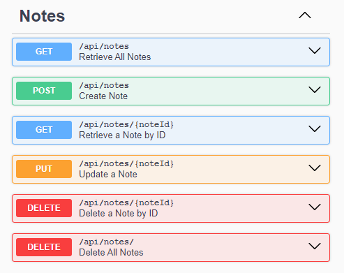
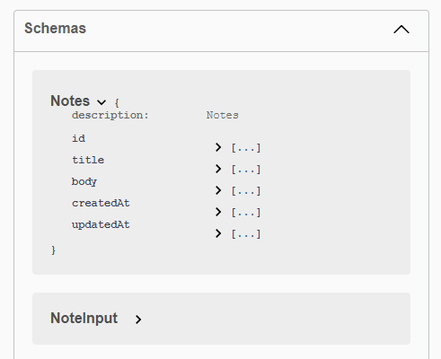

# Prisma + MongoDB + Express

##### A simple REST API CRUD using these tech stacks:

| Tool       | Description                                                                    |
| ---------- | ------------------------------------------------------------------------------ |
| TypeScript | Adds static typing to JavaScript, reducing bugs and improving maintainability. |
| Prisma     | Type-safe ORM for easy database modeling and interaction.                      |
| MongoDB    | NoSQL database for flexible, scalable data storage.                            |
| Express.js | Lightweight framework for building RESTful APIs.                               |
| Zod        | Runtime schema validation for TypeScript.                                      |
| Swagger    | Generates interactive API documentation for easy testing and exploration.      |
| Node.js    | Server-side JavaScript runtime for scalable applications.                      |
| ESLint     | Linter for maintaining code quality and consistency.                           |
| Prettier   | Code formatter for consistent and clean codestyle.                             |
| Jest       | Testing framework to ensure code reliability and catch regressions.            |

### Features

✅ Prisma integrated

✅ Swagger for api documentation

✅ Linting and formatting with eslint and prettier

✅ Testing with jest and supertest

✅ Commit hooks with husky

✅ Automates building, linting, formatting, and testing using GitHub Actions.

✅ Preconfigured error handlers

✅ Ensures consistent file naming convention

### Swagger API Documentation

Access the interactive Swagger UI for exploring and testing the API endpoints.

**Endpoint:**
`GET /api-docs`

### Scripts

Following are the list of predefined scripts available in the app

| Script Name     | Description                                                  | Command                 |
| --------------- | ------------------------------------------------------------ | ----------------------- |
| build           | Builds the app with tsc to dist folder.                      | npm run build           |
| dev             | Runs the app in watch mode with TypeScript paths registered. | npm run dev             |
| test            | Runs tests.                                                  | npm run test            |
| lint            | Lints the files with eslint.                                 | npm run lint            |
| lint:fix        | Lints and fixes files with eslint.                           | npm run lint:fix        |
| prettier        | Check the format of files with prettier.                     | npm run prettier        |
| prettier:fix    | Format files with prettier.                                  | npm run prettier:fix    |
| format          | Format files with prettier and eslint.                       | npm run format          |
| prisma:generate | Generates prisma client types.                               | npm run prisma:generate |
| prisma:dbpush   | Pushes Prisma schema changes to the database.                | npm run prisma:dbpush   |
| commit          | Opens commitizen.                                            | npm run commit          |
